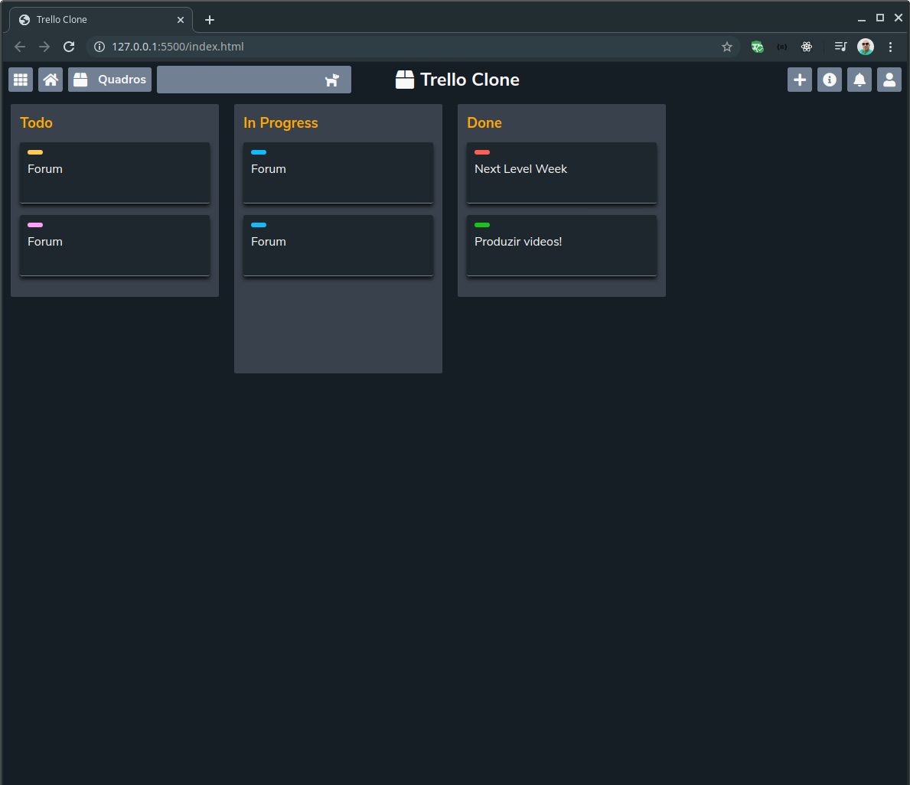

# Clone-Trello



# Sobre
- Página desenvolvida em HTML, CSS e JavaScript
  - Usei também o SASS para CSS

# Como baixar o projeto
- Abra o seu terminal
- Copie a url para clonar com o comando abaixo:
  ```bash
  git clone git@github.com:andrelinos/Clone-Trello.git
  ```
- Execute em seguida na pasta o comando `yarn` para baixar as dependências

# Como executar
Execute no terminal e de dentro da pasta o comando abaixo:
```bash
live-server .
```
- Será aberto em seu navegador padrão o projeto de exemplo.

# Como editar o proejeto
- Edite o arquivo `index.html` para alterar o texto e marcações da página
- Edite o arquivo `js/main.js` para alterar as funcionalidades do JavaScript.
- Edite os arquivos `scss/*.scss` para alterar os estilo da página.

# Notas
Este projeto está comas informaçẽos de forma estática. Pretendo acrescentar a funcionalidade de adicionar, editar e excluir itens usando banco de dados.
